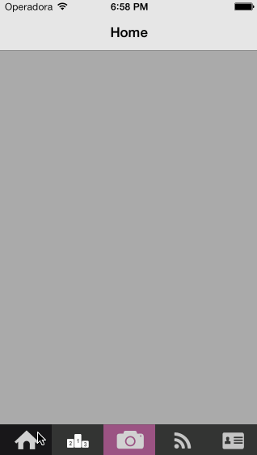

CACIRACustomTabBarController
============================

An example project to teach how to create a custom tab bar controller for iOS 7 with custom images and no text. 
I created this for a project I develop at my company (<a href="http://cacira.com.br">CACIRA mobile solutions</a>) called <a href="http://fashion85.com">Fashion85</a>, a mobile fashion social network.

See how it looks like below.

